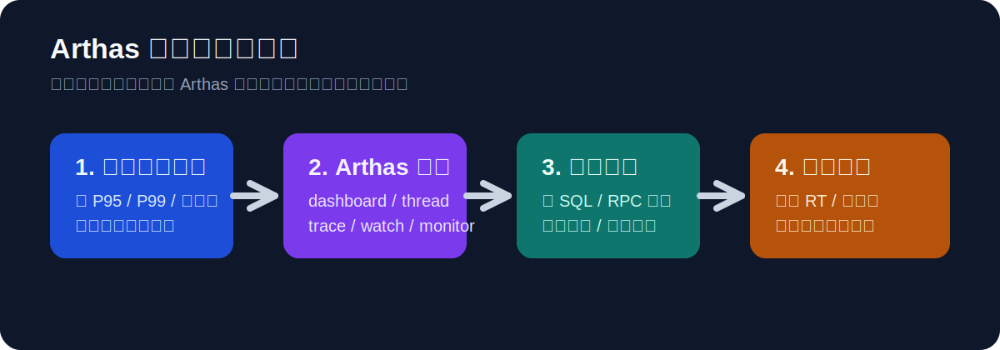
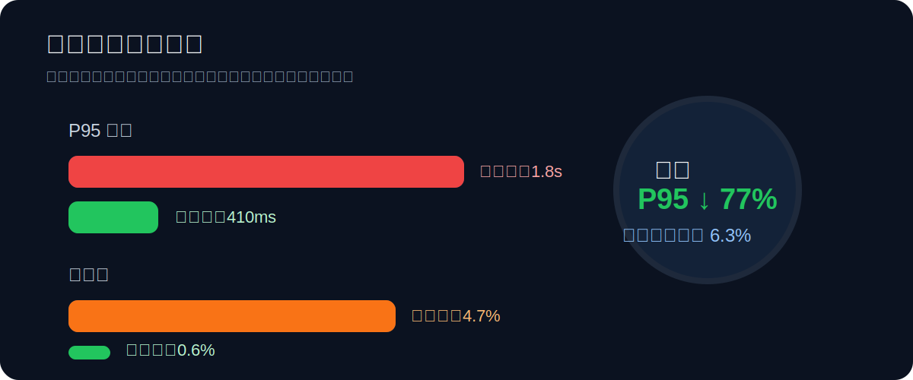
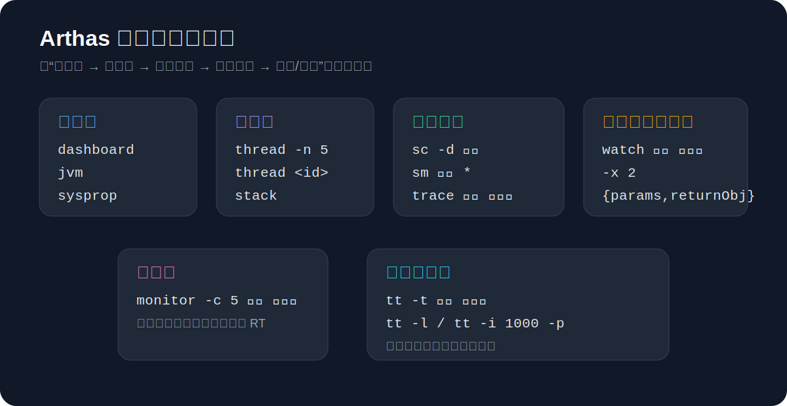
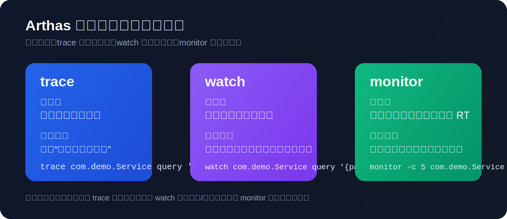

## Arthas 调优实战：案例复盘、命令速查与面试表达

## 一、为什么选择 Arthas 做线上调优

在常规优化里，我们经常会遇到三个问题：

- 指标有了，但定位不到具体慢点
- 发现了慢接口，但无法快速还原调用链
- 做完优化后，难以量化收益

Arthas 的价值在于在线观察运行中的 Java 应用，直接定位慢方法、异常栈和参数变化，让性能问题从“猜测”变成“可证据化定位”。



上图可以把这篇文章的主线概括成一句话：**先通过监控发现问题，再用 Arthas 找慢点，最后用结果数据验证优化是否真的有效。**

---

## 二、一个可复用的调优案例

### 1）问题现象

某活动页接口 `GET /api/activity/feed` 在高峰期出现明显抖动：

- P95 延迟：从 320ms 上升到 1.8s
- 超时率：从 0.3% 上升到 4.7%
- 数据库 CPU 高，但应用侧没有明显异常日志

### 2）基于 Arthas 的排查过程

#### 第一步：按接口维度看延迟分布

先通过监控确认 `service=feed-service` 的 `endpoint=/api/activity/feed` 在高峰时段 P95/P99 同步飙升，不是单点偶发，再进入 Arthas 做在线诊断。

#### 第二步：钻取慢链路样本

在 Tracing 里抽样查看慢请求，发现主要耗时集中在两个 span：

- `db.query_feed_candidates`
- `rpc.user-profile.batchGet`

#### 第三步：关联日志验证根因

同 traceId 关联日志后发现：

- `db.query_feed_candidates` 触发了非预期排序，未命中联合索引
- `rpc.user-profile.batchGet` 在热点时段退化为串行重试

### 3）优化动作

定位清楚之后，优化动作就不再是“凭经验试错”，而是围绕证据逐项收敛。

- 数据库侧：
  - 调整 SQL 的 where + order 字段顺序
  - 新增联合索引 `(tenant_id, status, score, created_at)`
- 应用侧：
  - `batchGet` 增加本地短缓存（30s）
  - 重试策略从串行改为有上限的并行重试
  - 加入请求级熔断，失败快速降级到兜底数据

### 4）结果对比

优化后一周对比：

- P95：1.8s → 410ms（下降约 77%）
- 超时率：4.7% → 0.6%
- 数据库慢查询占比：12.4% → 2.1%
- 活动页转化率：提升约 6.3%

> 关键点：不是“改了一堆参数”，而是 Arthas 提供了从症状到根因的证据链，优化动作更精准。



---

## 三、Arthas 用法与常用命令速查

### 1）如何连接到目标进程

```bash
# 1. 启动 arthas
curl -O https://arthas.aliyun.com/arthas-boot.jar
java -jar arthas-boot.jar

# 2. 选择目标 Java 进程（输入序号）
# 3. 进入后即可执行命令
```

### 2）性能排查的常用流程

如果是第一次在线上使用 Arthas，最稳妥的方式不是一上来就打印复杂对象，而是先按“全局 → 线程 → 方法 → 参数”的顺序逐步缩小范围。

1. 用 `dashboard` 看线程、内存、GC、QPS 的整体状态。
2. 用 `thread -n 5` 找最忙线程，判断是否有 CPU 热点。
3. 用 `sc` / `sm` 确认目标类和方法是否命中。
4. 用 `trace` 看方法链路耗时分布，先定位“最慢的一段”。
5. 用 `watch` 看入参、返回值、异常，确认是否有脏数据或重试放大。
6. 必要时用 `tt` 录制并回放调用，复盘偶发问题。

### 3）常用命令速查



```bash
# 基础状态
help                            # 查看帮助
dashboard                       # 总览：线程/内存/GC/负载
thread -n 5                     # 查看最忙的 5 个线程
jvm                             # JVM 信息
sysprop | grep profile          # 系统属性

# 类与方法定位
sc -d com.example.FeedService   # 查类是否已加载
sm com.example.FeedService *    # 查看类下方法

# 性能与调用诊断
trace com.example.FeedService getFeed '#cost > 100' -n 5
# 跟踪方法调用链，筛选耗时 >100ms 的调用，最多看 5 次

trace -E "com.example.MemberController|com.example.MemberService" memberCampaignList

watch com.example.FeedService getFeed '{params,returnObj,throwExp,cost}' -x 2 -n 5
# 观察入参、返回值、异常和耗时（对象展开层级 2）

monitor -c 5 com.example.FeedService getFeed
# 每 5 秒统计一次调用次数、成功率、RT

tt -t com.example.FeedService getFeed
# 录制调用
tt -l
# 查看录制列表
tt -i 1000 -p
# 重放指定调用（index 按实际值替换）

# 线上热修（慎用，需流程审批）
jad --source-only com.example.FeedService > /tmp/FeedService.java
mc /tmp/FeedService.java -d /tmp
redefine /tmp/com/example/FeedService.class

# 退出
stop
```

### 4）实战建议



- 先粗后细：`dashboard`/`thread` 先看全局，再 `trace` 打点。
- 表达式从简：先只看 `#cost`，确认慢点后再加复杂条件。
- 控制样本量：多用 `-n`，避免线上输出过多影响性能。
- 注意脱敏：`watch` 打印对象时避免输出敏感字段。

---

## 四、STAR 复盘模板（可直接用于汇报）

### S（Situation）

活动大促期间，Feed 接口在高峰时段出现严重延迟抖动，影响首屏加载和下游转化。

### T（Task）

目标是在不扩容的前提下，将接口 P95 控制在 500ms 内，并把超时率压到 1% 以下。

### A（Action）

- 使用 Arthas 按方法维度锁定问题时间窗
- 通过 Tracing 确认耗时集中在 DB 查询与用户信息 RPC
- 结合日志与 SQL 执行计划，定位到索引失配和重试策略退化
- 落地联合索引、缓存、并行重试和熔断降级
- 建立调优后看板，持续跟踪 P95/P99 与错误率

### R（Result）

- P95 从 1.8s 降到 410ms
- 超时率从 4.7% 降到 0.6%
- 慢查询占比从 12.4% 降到 2.1%
- 业务转化率提升约 6.3%

---

## 五、总结：调优真正沉淀下来的方法论

这次调优的核心经验：

1. **先定义目标，再做动作**：先给出可量化目标（如 P95、超时率），避免无效优化。
2. **坚持证据链定位**：指标发现异常，链路定位模块，日志验证根因。
3. **优先处理高杠杆点**：索引、缓存、重试策略通常比“盲目扩容”更有效。
4. **优化必须可回归验证**：没有前后对比数据，优化就不算闭环。

---

## 六、面试口述版（1~2 分钟可直接回答）

我做过一次基于 Arthas 的性能调优。背景是大促期间，Feed 接口 P95 从 300 多毫秒飙到接近 2 秒，超时率接近 5%，直接影响首屏体验和转化。

我的任务是在不扩容的情况下，把 P95 压到 500ms 以内，超时率控制在 1% 以下。

具体做法是先通过监控锁定时段，确认问题不是偶发；然后在 Arthas 用 `trace` 和 `watch` 看慢方法样本，发现耗时主要在数据库查询和用户信息 RPC；接着结合日志定位到 SQL 没命中联合索引，以及 RPC 在高峰时段退化成串行重试。

针对这两个点，我做了联合索引优化、短时缓存、并行有上限重试和熔断降级。上线后一周，P95 从 1.8 秒降到 410ms，超时率从 4.7% 降到 0.6%，慢查询占比明显下降，业务转化也有提升。

这次让我形成了一个稳定方法：用 Arthas 建立“监控—方法诊断—日志”的证据链，先定位高杠杆问题，再用数据验证优化收益。
